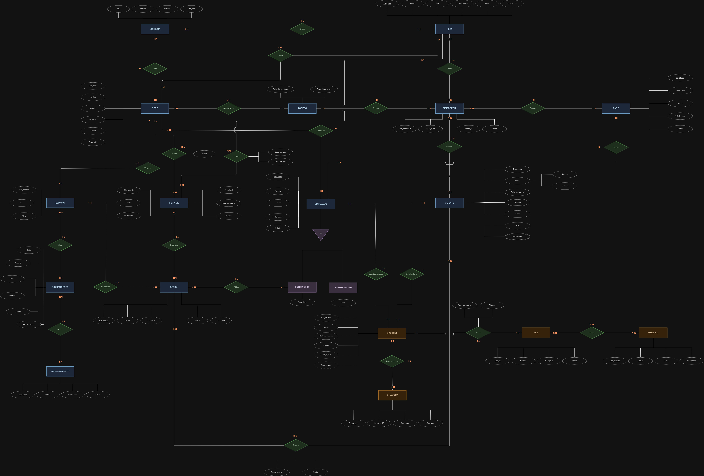

# GymCore — Plataforma de gestión multi-cadena para gimnasios

**Entrega 1 — Bases de Datos I**
Universidad Industrial de Santander · Escuela de Ingeniería de Sistemas e Informática

> **GymCore** es el diseño de una base de datos para una plataforma que administra
> **varias empresas** de gimnasios, cada una con **múltiples sedes**, unificando
> membresías, control de acceso, servicios, personal, equipamiento y facturación
> bajo un mismo modelo de datos.

---

## Integrantes del grupo

| # | Nombre completo | Código |
|---|-----------------|--------|
| 1 | Javier Steben Santana Blanco | 2251641 |
| 2 | Andrés Felipe Pilonieta Forero | 2250170 |
| 3 | Samuel Jose Niño Solano | 2250177 |
| 4 | José Alejandro Pinzón Forero | 2251257 |
| 5 | Juan Pablo Rueda Angarita | 2250160 |

---

## Contenido

1. [Contexto del problema trabajado en la actividad de exploración](#1-contexto-del-problema-trabajado-en-la-actividad-de-exploración)
2. [Consulta de tendencias actuales en el área del proyecto](#2-consulta-de-tendencias-actuales-en-el-área-del-proyecto)
3. [Consulta de herramientas o sistemas similares con su análisis de funcionalidades](#3-consulta-de-herramientas-o-sistemas-similares-con-su-análisis-de-funcionalidades)
4. [Modelo E-R del proyecto](#4-modelo-e-r-del-proyecto)
5. [Referencias](#referencias)

---

## 1. Contexto del problema trabajado en la actividad de exploración

### 1.1 Situación

El mercado colombiano de gimnasios está dominado por **cadenas**, no por locales
independientes. Smart Fit supera las **200 sedes** en el país y Bodytech opera más
de **170 sedes** entre Colombia y Chile con cerca de **300.000 afiliados**. Ese
tamaño cambia por completo el problema de información: ya no se trata de llevar el
control de un gimnasio, sino de operar **una red**.

La operación real impone condiciones que un archivo plano o una hoja de cálculo no
soportan:

- Un cliente compra una membresía **en una empresa**, pero entrena en **cualquier
  sede habilitada por su plan**. El acceso debe validarse en el torniquete en
  segundos.
- El precio no es único: existen planes por duración (mensual, trimestral, anual),
  por franja horaria (la *hora naranja* de Bodytech, entre semana en horas valle) y
  por nivel de beneficios (los planes Fit, Smart y Black de Smart Fit, con tarifas
  que en 2026 van de $69.900 a $119.900 mensuales).
- Cada sede tiene **espacios** distintos (zona de pesas, salón de clases, cardio,
  consultorio) con **aforos** propios y **equipamiento** que se daña, se repara y
  se reemplaza.
- Los servicios que requieren reserva (clases grupales, valoración física,
  entrenamiento personalizado) compiten por cupo, espacio, horario y entrenador.

### 1.2 Problema de datos

> ¿Cómo modelar una única base de datos que permita a **varias empresas de
> gimnasios**, cada una con **varias sedes**, administrar clientes, planes,
> membresías, pagos, accesos, servicios, sesiones, personal y equipamiento, sin
> mezclar la información entre empresas y sin duplicar datos entre sedes?

### 1.3 Alcance

**Dentro del alcance**

- Registro de empresas, sedes y espacios físicos.
- Catálogo de planes, servicios y su cobertura por sede.
- Ciclo de vida de la membresía: adquisición, vigencia, renovación y estado.
- Pagos y facturación asociados a la membresía.
- Control de acceso y asistencia por sede.
- Programación de sesiones, reservas de clientes y cupos.
- Personal (entrenadores y administrativos) y su asignación a sedes.
- Inventario de equipamiento y su historial de mantenimiento.
- Acceso a la plataforma: usuarios, roles, permisos y bitácora de ingresos.

**Fuera del alcance de esta entrega**

- Nómina, contabilidad y obligaciones tributarias.
- Rutinas de entrenamiento y seguimiento antropométrico detallado.
- Integraciones con pasarelas de pago o con dispositivos wearables.
- Diseño de la interfaz de usuario.

### 1.4 Conceptos clave del dominio

| Concepto | Descripción |
|----------|-------------|
| **Empresa** | Cadena propietaria de las sedes (Smart Fit, Bodytech). Es la raíz del modelo: separa la información de un operador de la de otro. |
| **Sede** | Local físico de una empresa. Tiene ciudad, dirección, teléfono y aforo máximo. |
| **Espacio** | Subdivisión interna de una sede (pesas, cardio, salón, consultorio) con aforo propio. |
| **Plan** | Producto comercial: duración, precio, franja horaria y beneficios. Define qué sedes cubre y qué servicios incluye. |
| **Membresía** | Instancia de un plan adquirida por un cliente, con fecha de inicio, fecha de fin y estado (activa, vencida, suspendida). |
| **Cliente** | Persona afiliada. Se registran datos personales, contacto, RH y restricciones médicas. |
| **Pago** | Comprobante asociado a una membresía: número de factura, fecha, monto, método y estado. |
| **Acceso** | Registro de entrada y salida de un cliente en una sede. Es la evidencia de asistencia y la validación de la membresía. |
| **Servicio** | Actividad ofrecida (cardio, clase grupal, valoración física, entrenamiento personalizado). Puede requerir reserva o no. |
| **Sesión** | Ocurrencia programada de un servicio, con fecha, hora, cupo máximo, espacio y entrenador. |
| **Reserva** | Inscripción de un cliente a una sesión, con fecha y estado (confirmada, cancelada, asistió). |
| **Empleado** | Personal de la empresa asignado a una sede. Se especializa en entrenador o administrativo. |
| **Equipamiento** | Máquina o elemento de entrenamiento, ubicado en un espacio, con estado y fecha de compra. |
| **Mantenimiento** | Reporte de intervención sobre un equipo: fecha, descripción y costo. |
| **Aforo** | Capacidad máxima de personas de una sede, un espacio o una sesión. |
| **Usuario / Rol / Permiso** | Credenciales de acceso a la plataforma y control de qué puede hacer cada quien. |

### 1.5 Reglas de negocio identificadas

1. Una sede pertenece a **una sola** empresa y no existe fuera de ella.
2. Un plan pertenece a una empresa y puede **cubrir varias sedes**; una sede puede
   estar cubierta por varios planes.
3. Un cliente puede adquirir varias membresías a lo largo del tiempo, pero solo una
   **activa** por empresa en un mismo período.
4. Un acceso solo es válido si la membresía está activa y el plan cubre esa sede.
5. Una sesión no puede superar el aforo del espacio en el que se dicta.
6. Un cliente no puede reservar dos sesiones que se solapen en horario.
7. Todo equipamiento está ubicado en un espacio y solo en uno a la vez.
8. Todo empleado es entrenador **o** administrativo, nunca ambos ni ninguno.
9. Solo un empleado puede registrar un pago.
10. Todo ingreso a la plataforma queda registrado en la bitácora del usuario.

### 1.6 Preguntas que la base de datos debe poder responder

- ¿Cuántos clientes activos tiene cada sede este mes?
- ¿Qué porcentaje del aforo se está usando por franja horaria?
- ¿Cuáles son las membresías que vencen en los próximos 15 días?
- ¿Cuánto facturó cada sede por método de pago?
- ¿Qué equipos llevan más tiempo sin mantenimiento?
- ¿Qué clases tienen mayor tasa de cancelación de reservas?
- ¿Qué clientes no asisten hace más de 30 días (riesgo de deserción)?

---

## 2. Consulta de tendencias actuales en el área del proyecto

Las tendencias del sector no son adorno: cada una **obliga a guardar un dato** que
el modelo debe prever desde ahora.

### 2.1 Tendencias del negocio

| Tendencia | En qué consiste |
|-----------|-----------------|
| **Membresías flexibles y segmentadas** | El plan único desapareció. Hoy se vende por franja horaria (*hora naranja* de Bodytech), por nivel de beneficios (Fit / Smart / Black en Smart Fit) y por alcance de red (una sede vs. todas las sedes del país). |
| **Modelo low-cost de alto volumen** | Smart Fit llegó a Colombia en 2016 y ya supera las 200 sedes con tarifas desde $69.900. El margen por cliente es bajo, así que la operación depende de automatizar todo y de medir la ocupación con precisión. |
| **Expansión multi-sede y multi-país** | Bodytech opera en Colombia y Chile. La plataforma debe soportar varias empresas, varias ciudades y reglas de cobertura distintas por plan. |
| **Retención por encima de captación** | El indicador que importa es el *churn*. Eso exige historial de asistencia por cliente, no solo el estado de la membresía. |
| **Pagos digitales** | La transferencia digital desplazó al efectivo: Nequi supera los 27 millones de usuarios en Colombia. El método de pago debe ser un atributo de primera clase, no un texto libre. |

### 2.2 Tendencias tecnológicas

| Tendencia | En qué consiste |
|-----------|-----------------|
| **Reconocimiento biométrico y control de acceso automatizado** | Huella dactilar, reconocimiento facial o QR en el torniquete reemplazan el carné. El check-in genera un registro por evento, con fecha y hora exactas. |
| **Apps móviles de socio** | Reserva de clases, consulta de saldo y renovación desde el celular, con recordatorios automáticos. |
| **Wearables e integración de datos** | Relojes y pulseras aportan datos de actividad que se cruzan con los del gimnasio. |
| **Personalización basada en datos** | Recomendación de rutinas y de clases según el historial del cliente. Sin historial almacenado, no hay personalización posible. |
| **Inteligencia artificial aplicada a la retención** | Predicción de abandono y de ocupación por franja horaria a partir de los registros de acceso y reserva. |
| **Realidad virtual y aumentada** | Clases inmersivas y ciclo indoor interactivo, que se modelan como servicios con modalidad propia. |
| **Analítica operativa en tiempo real** | Tableros de ocupación, facturación y uso de equipos por sede. |

### 2.3 Cómo estas tendencias impactan el diseño de la base de datos

| Tendencia | Decisión de modelado adoptada |
|-----------|-------------------------------|
| Membresías flexibles | `PLAN` con `Franja_horaria`, `Tipo` y `Duración_meses`; relación `Cubre` **N:M** entre `PLAN` y `SEDE`. |
| Multi-empresa / multi-sede | `EMPRESA` como entidad raíz y `SEDE` como **entidad débil** identificada por ella. |
| Control de acceso biométrico | `ACCESO` como **entidad débil** de `MEMBRESÍA`, con clave parcial `Fecha_hora_entrada`: un registro por evento, no un contador. |
| Retención y analítica | El histórico de `ACCESO` y de `Reserva` permite calcular asistencia, ocupación y riesgo de deserción sin campos calculados redundantes. |
| Pagos digitales | `PAGO` con `Método_pago` y `Estado` como atributos propios, y `Nº_factura` como clave. |
| Servicios con y sin reserva | `SERVICIO.Requiere_reserva` y `Modalidad`; las sesiones reservables se modelan aparte en `SESIÓN`. |
| App de socio con login | Subsistema `USUARIO` / `ROL` / `PERMISO` y `BITÁCORA` de ingresos. |
| Mantenimiento preventivo | `MANTENIMIENTO` como **entidad débil** de `EQUIPAMIENTO`, para conservar el historial completo. |

---

## 3. Consulta de herramientas o sistemas similares con su análisis de funcionalidades

Se analizaron cuatro plataformas comerciales de gestión de gimnasios. El criterio
de selección fue cubrir los tres perfiles del mercado: **cadena grande**,
**estudio boutique** y **producto con presencia en habla hispana**.

### 3.1 PerfectGym

Plataforma de nivel *enterprise*, diseñada específicamente para **cadenas y clubes
multi-sede**. Es la referencia más cercana a lo que plantea GymCore.

**Funcionalidades analizadas**

- Gestión del ciclo de vida completo de la membresía (venta, renovación,
  congelación, cancelación).
- Facturación recurrente automatizada y conciliación de pagos.
- **Control de acceso integrado** con torniquetes y lectores biométricos.
- Programación de clases y reservas con gestión de cupos y listas de espera.
- CRM y analítica orientada a retención.
- App móvil de marca blanca para el socio.
- Administración centralizada de la cadena con reportes por sede.

**Lectura para nuestro modelo:** confirma la necesidad de separar `EMPRESA` →
`SEDE` → `ESPACIO` y de tratar el acceso como un evento registrado, no como un
booleano de "está adentro".

### 3.2 Mindbody

Una de las plataformas más consolidadas del sector, orientada a **operadores
grandes y multi-sede** en bienestar y fitness. Su fortaleza es el ecosistema de
integraciones y el mercado de reservas para el usuario final.

**Funcionalidades analizadas**

- Agenda y reservas de clases y servicios individuales.
- Gestión de membresías, paquetes de sesiones y bonos.
- Procesamiento de pagos y punto de venta.
- Módulo de marketing y campañas de retención.
- Amplio catálogo de integraciones con terceros.
- Reportes de negocio por local.

**Lectura para nuestro modelo:** la coexistencia de "membresía por tiempo" y
"paquete de sesiones" justifica que `PLAN` tenga `Tipo` y que la relación
`Incluye` entre `PLAN` y `SERVICIO` lleve el atributo `Cupo_mensual`.

### 3.3 Trainingym

Plataforma con fuerte presencia en el mercado hispanohablante, orientada a la
**experiencia del socio y a la personalización con IA**.

**Funcionalidades analizadas**

- App del socio con rutinas personalizadas y recomendaciones automáticas.
- Seguimiento de progreso y valoraciones físicas.
- Gestión de membresías, reservas y comunicación con el cliente.
- Analítica de uso y de satisfacción.
- Check-in digital y control de aforo.

**Lectura para nuestro modelo:** la valoración física y el entrenamiento
personalizado son **servicios que requieren reserva y entrenador asignado**, lo que
sustenta las relaciones `Dirige` (`ENTRENADOR` → `SESIÓN`) y `Reserva`
(`CLIENTE` ↔ `SESIÓN`).

### 3.4 Glofox

Solución **mobile-first** enfocada en estudios boutique. Destaca por la app de
marca del socio y por la automatización de cobros.

**Funcionalidades analizadas**

- Reserva de clases desde app, con cupos limitados.
- Cobros automáticos recurrentes.
- Gestión de membresías y paquetes.
- Herramientas de engagement y notificaciones.

**Lectura para nuestro modelo:** el cupo por clase es un dato crítico y propio de
la sesión, no del servicio; por eso `SESIÓN` tiene `Cupo_máx` además del `Aforo`
del `ESPACIO`.

### 3.5 Cuadro comparativo de funcionalidades

| Funcionalidad | PerfectGym | Mindbody | Trainingym | Glofox | **GymCore (propuesto)** |
|---------------|:---------:|:--------:|:----------:|:------:|:-----------------------:|
| Multi-empresa (varias cadenas) | ✗ | ✗ | ✗ | ✗ | ✔ |
| Multi-sede | ✔ | ✔ | ✔ | Parcial | ✔ |
| Gestión de membresías y planes | ✔ | ✔ | ✔ | ✔ | ✔ |
| Cobertura de plan por sede | ✔ | Parcial | Parcial | ✗ | ✔ |
| Pagos y facturación | ✔ | ✔ | ✔ | ✔ | ✔ |
| Control de acceso / torniquete | ✔ | Parcial | ✔ | ✗ | ✔ |
| Reserva de clases y cupos | ✔ | ✔ | ✔ | ✔ | ✔ |
| Gestión de espacios y aforo | ✔ | Parcial | ✔ | Parcial | ✔ |
| Inventario y mantenimiento de equipos | ✔ | ✗ | Parcial | ✗ | ✔ |
| Gestión de personal por sede | ✔ | ✔ | ✔ | Parcial | ✔ |
| Roles y permisos | ✔ | ✔ | ✔ | ✔ | ✔ |
| Bitácora de auditoría | ✔ | Parcial | Parcial | ✗ | ✔ |
| App móvil del socio | ✔ | ✔ | ✔ | ✔ | Fuera de alcance |
| Rutinas y seguimiento antropométrico | Parcial | Parcial | ✔ | Parcial | Fuera de alcance |
| IA / predicción de deserción | Parcial | Parcial | ✔ | ✗ | Fuera de alcance |

> *Parcial* indica que la plataforma cubre la funcionalidad de forma limitada o
> mediante integración con un tercero.

### 3.6 Conclusiones del análisis

1. **Ninguna de las plataformas revisadas es multi-empresa.** Todas asumen un
   operador único con varias sedes. La capacidad de administrar **varias cadenas
   sobre una misma base de datos** es el diferenciador de GymCore y explica que
   `EMPRESA` sea la entidad raíz del modelo.
2. **El control de acceso y el inventario de equipos son el punto débil del
   mercado.** Solo las plataformas *enterprise* los cubren bien. Incluirlos desde
   el modelo E-R es una decisión deliberada.
3. **Todas separan el producto comercial (plan) de la instancia contratada
   (membresía).** El modelo replica esa separación con `PLAN` → `Define` →
   `MEMBRESÍA`.
4. **La reserva es una entidad con datos propios**, no un simple vínculo: lleva
   fecha y estado. Por eso `Reserva` es una relación N:M con atributos.
5. Rutinas, IA y app móvil se dejan **explícitamente fuera del alcance** de esta
   entrega: son capas de aplicación construidas *sobre* el modelo de datos, no
   parte de él.

---

## 4. Modelo E-R del proyecto

### 4.1 Diagrama

**Resumen del modelo:** 19 entidades (14 fuertes y 5 débiles), 24 relaciones y una
especialización total y disjunta.

| Archivo | Ruta |
|---------|------|
| Diagrama (imagen) | [`Entrega_1/Entrega_Final_01/Modelo_Entidad_Relacion.jpg`](./Modelo_Entidad_Relacion.jpg) |
| Diagrama (editable, draw.io) | [`Entrega_1/Entrega_Final_01/Modelo_Entidad_Relacion.drawio`](./Modelo_Entidad_Relacion.drawio) |

### 4.2 Entidades y atributos

Las claves primarias van **subrayadas** en el diagrama; aquí se marcan con `PK`.
Las claves parciales de las entidades débiles se marcan con `PK parcial`.

#### Entidades fuertes

| Entidad | Atributos |
|---------|-----------|
| **EMPRESA** | `NIT` (PK), Nombre, Teléfono, Sitio_web |
| **PLAN** | `Cód_plan` (PK), Nombre, Tipo, Duración_meses, Precio, Franja_horaria |
| **MEMBRESÍA** | `Cód_membresía` (PK), Fecha_inicio, Fecha_fin, Estado |
| **PAGO** | `Nº_factura` (PK), Fecha_pago, Monto, Método_pago, Estado |
| **SERVICIO** | `Cód_servicio` (PK), Nombre, Descripción, Modalidad, Requiere_reserva |
| **CLIENTE** | `Documento` (PK), Nombre *(compuesto: Nombres, Apellidos)*, Fecha_nacimiento, Teléfono *(multivaluado)*, Email, RH, Restricciones *(multivaluado)* |
| **EMPLEADO** | `Documento` (PK), Nombre, Teléfono, Fecha_ingreso, Salario |
| **ENTRENADOR** | Especialidad *(subtipo de EMPLEADO)* |
| **ADMINISTRATIVO** | Área *(subtipo de EMPLEADO)* |
| **EQUIPAMIENTO** | `Serial` (PK), Nombre, Marca, Modelo, Estado, Fecha_compra |
| **SESIÓN** | `Cód_sesión` (PK), Fecha, Hora_inicio, Hora_fin, Cupo_máx |
| **USUARIO** | `Cód_usuario` (PK), Correo, Hash_contraseña, Estado, Fecha_registro, Último_ingreso *(derivado)* |
| **ROL** | `Cód_rol` (PK), Nombre, Descripción, Ámbito |
| **PERMISO** | `Cód_permiso` (PK), Módulo, Acción, Descripción |

#### Entidades débiles

| Entidad débil | Depende de | Relación identificadora | Atributos |
|---------------|-----------|-------------------------|-----------|
| **SEDE** | EMPRESA | `Tiene` | `Cód_sede` (PK parcial), Nombre, Ciudad, Dirección, Teléfono, Aforo_máx |
| **ESPACIO** | SEDE | `Contiene` | `Cód_espacio` (PK parcial), Tipo, Aforo |
| **ACCESO** | MEMBRESÍA | `Registra` | `Fecha_hora_entrada` (PK parcial), Fecha_hora_salida |
| **MANTENIMIENTO** | EQUIPAMIENTO | `Recibe` | `Nº_reporte` (PK parcial), Fecha, Descripción, Costo |
| **BITÁCORA** | USUARIO | `Registra ingreso` | `Fecha_hora` (PK parcial), Dirección_IP, Dispositivo, Resultado |

### 4.3 Relaciones y cardinalidad

| # | Entidad A | Relación | Entidad B | Cardinalidad | Lectura |
|---|-----------|----------|-----------|:------------:|---------|
| 1 | EMPRESA | Tiene *(identificadora)* | SEDE | **1:N** | Una empresa tiene muchas sedes; una sede pertenece a una empresa. |
| 2 | EMPRESA | Ofrece | PLAN | **1:N** | Una empresa ofrece muchos planes. |
| 3 | PLAN | Cubre | SEDE | **N:M** | Un plan cubre varias sedes; una sede es cubierta por varios planes. |
| 4 | PLAN | Define | MEMBRESÍA | **1:N** | Un plan da origen a muchas membresías. |
| 5 | PLAN | Incluye | SERVICIO | **N:M** | Un plan incluye varios servicios; un servicio está en varios planes. |
| 6 | CLIENTE | Adquiere | MEMBRESÍA | **1:N** | Un cliente adquiere varias membresías a lo largo del tiempo. |
| 7 | MEMBRESÍA | Genera | PAGO | **1:N** | Una membresía genera uno o varios pagos. |
| 8 | EMPLEADO | Registra pago | PAGO | **1:N** | Un empleado registra muchos pagos; cada pago lo registra un empleado. |
| 9 | MEMBRESÍA | Registra *(identificadora)* | ACCESO | **1:N** | Una membresía acumula muchos accesos. |
| 10 | SEDE | Se realiza en | ACCESO | **1:N** | Cada acceso ocurre en una sede. |
| 11 | SEDE | Contiene *(identificadora)* | ESPACIO | **1:N** | Una sede contiene varios espacios. |
| 12 | SEDE | Presta | SERVICIO | **N:M** | Una sede presta varios servicios; un servicio se presta en varias sedes. |
| 13 | SEDE | Labora en | EMPLEADO | **1:N** | Una sede tiene varios empleados; un empleado labora en una sede. |
| 14 | ESPACIO | Aloja | EQUIPAMIENTO | **1:N** | Un espacio aloja varios equipos; cada equipo está en un espacio. |
| 15 | EQUIPAMIENTO | Recibe *(identificadora)* | MANTENIMIENTO | **1:N** | Un equipo acumula varios reportes de mantenimiento. |
| 16 | SERVICIO | Programa | SESIÓN | **1:N** | Un servicio se programa en muchas sesiones. |
| 17 | ESPACIO | Se dicta en | SESIÓN | **1:N** | Cada sesión se dicta en un espacio. |
| 18 | ENTRENADOR | Dirige | SESIÓN | **1:N** | Un entrenador dirige varias sesiones; cada sesión tiene un entrenador. |
| 19 | CLIENTE | Reserva | SESIÓN | **N:M** | Un cliente reserva varias sesiones; una sesión recibe varias reservas. |
| 20 | EMPLEADO | Cuenta empleado | USUARIO | **1:1** | Cada empleado tiene una única cuenta de plataforma. |
| 21 | CLIENTE | Cuenta cliente | USUARIO | **1:1** | Cada cliente tiene una única cuenta de plataforma. |
| 22 | USUARIO | Posee | ROL | **N:M** | Un usuario posee varios roles; un rol lo poseen varios usuarios. |
| 23 | ROL | Otorga | PERMISO | **N:M** | Un rol otorga varios permisos; un permiso pertenece a varios roles. |
| 24 | USUARIO | Registra ingreso *(identificadora)* | BITÁCORA | **1:N** | Cada usuario acumula muchos registros de ingreso. |

### 4.4 Supuestos y restricciones del modelo

1. Un cliente puede estar afiliado a más de una empresa, pero cada membresía
   pertenece a un único plan y, por lo tanto, a una única empresa.
2. El acceso se valida contra la membresía, y la sede a la que se ingresa debe
   estar entre las que cubre el plan (`Cubre`). Esta restricción **no es
   expresable en el diagrama E-R** y se implementará como regla de integridad.
3. `MEMBRESÍA.Estado` se mantiene explícito (activa, vencida, suspendida,
   cancelada) en lugar de derivarse solo de las fechas, porque una membresía puede
   suspenderse dentro de su período de vigencia.
4. `SESIÓN.Cupo_máx` no puede superar `ESPACIO.Aforo`; también es una restricción
   de integridad fuera del diagrama.
5. `USUARIO` es opcional para el cliente: un cliente puede existir sin cuenta en la
   plataforma (afiliación presencial), pero una cuenta siempre pertenece a un
   cliente o a un empleado.
6. El precio queda congelado en `PLAN.Precio` al momento de la venta; los cambios
   de tarifa generan un nuevo plan y no alteran las membresías vigentes.

---

## Referencias

- Trainingym. *Tendencias tecnológicas en la industria del fitness.* <https://blog.trainingym.com/tendencias-tecnologicas-en-la-industria-del-fitness>
- Trainingym. *10 mejores apps de gestión para centros fitness en 2026.* <https://blog.trainingym.com/es/blog/10-mejores-apps-gestion-centros-fitness-2026>
- Resamania. *13 tendencias fitness 2026 que los gimnasios deben conocer.* <https://resamania.es/blog/tendencias-fitness/>
- G2. *Evaluation of the 8 Best Gym Management Software (2026).* <https://learn.g2.com/best-gym-management-software>
- 1Club. *Best Gym Management Software 2026 — Compare 10 Leading Platforms.* <https://1club.ai/blog/best-gym-management-software-2026>
- El Colombiano. *Smart Fit y Bodytech mandan en el mercado de gimnasios en Colombia.* <https://www.elcolombiano.com/negocios/smart-fit-bodytech-mandan-en-mercado-de-gimnasios-en-colombia-CC21988208>
- El Tiempo. *¿Cuánto vale inscribirse al gimnasio en 2026? Tarifas de Bodytech, Spinning Center y Smart Fit.* <https://www.eltiempo.com/cultura/gente/cuanto-vale-inscribirse-al-gimnasio-en-2026-estas-son-las-tarifas-de-bodytech-spinning-center-y-smartfit-3522055>
- Smart Fit Colombia. *Locales de la red.* <https://www.smartfit.com.co/sedes>
- Bodytech Colombia. *Sitio oficial.* <https://bodytech.com.co/>
