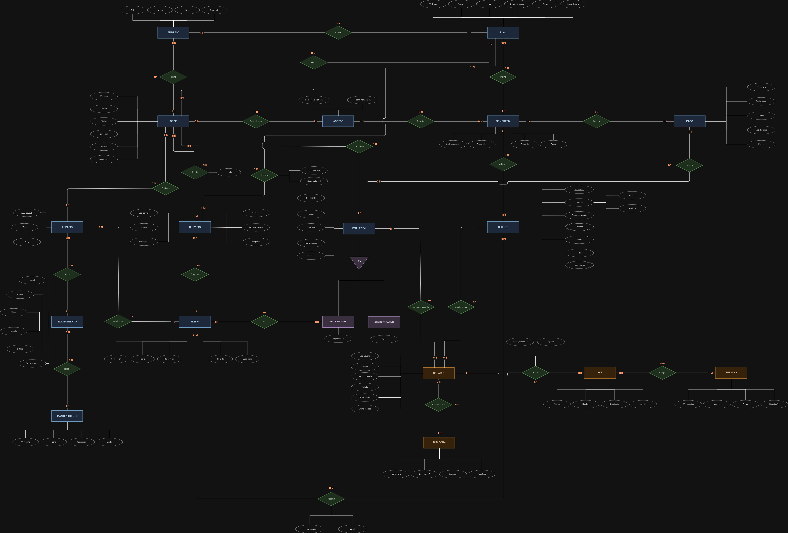

# Modelo E-R — Entrega 2

Modelo conceptual del proyecto **GymCore** sobre el que construimos el modelo
relacional de esta entrega.

---

## Archivos de la primera entrega

Los archivos de la primera entrega los dejamos sin modificar en su carpeta
original, para conservar lo que se entregó en su momento:

| Archivo | Ruta |
|---------|------|
| Documento entregable de la Entrega 1 | [`Entrega_1/Entrega_Final_01/README.md`](../../Entrega_1/Entrega_Final_01/README.md) |
| Diagrama E-R original (imagen) | [`Entrega_1/Entrega_Final_01/Modelo_Entidad_Relacion.jpg`](../../Entrega_1/Entrega_Final_01/Modelo_Entidad_Relacion.jpg) |
| Diagrama E-R original (editable, draw.io) | [`Entrega_1/Entrega_Final_01/Modelo_Entidad_Relacion.drawio`](../../Entrega_1/Entrega_Final_01/Modelo_Entidad_Relacion.drawio) |
| Actividad de exploración | [`Entrega_1/Actividad_de_Exploracion/`](../../Entrega_1/Actividad_de_Exploracion/) |
| Primera propuesta (bosquejo) | [`Entrega_1/Diagramas/Primera_Propuesta.jpg`](../../Entrega_1/Diagramas/Primera_Propuesta.jpg) |

---

## Diagrama E-R corregido

| Archivo | Ruta |
|---------|------|
| Diagrama corregido (imagen) | [`Entrega_2/Modelo_E-R/Modelo_Entidad_Relacion_Corregido.jpg`](./Modelo_Entidad_Relacion_Corregido.jpg) |
| Diagrama corregido (editable, draw.io) | [`Entrega_2/Modelo_E-R/Modelo_Entidad_Relacion_Corregido.drawio`](./Modelo_Entidad_Relacion_Corregido.drawio) |

---

## Nota sobre el cambio de cardinalidades

> Al revisar el modelo E-R para pasarlo al modelo relacional, **encontramos
> algunos procesos y relaciones cuyas cardinalidades no nos parecían
> adecuadas**. Por eso decidimos corregirlas desde ahora, antes de tiempo, y
> construir el modelo relacional sobre el diagrama ya corregido.

No agregamos ni eliminamos entidades, atributos ni relaciones: el diagrama
sigue teniendo **19 entidades y 24 relaciones**, y el tipo de cada relación
(1:1, 1:N o N:M) se mantiene. Lo que cambiamos son las etiquetas de
participación `(mín:máx)` que acompañan a cada entidad en sus relaciones.

Hicimos dos tipos de corrección:

1. **Etiquetas invertidas.** En varias relaciones 1:N las etiquetas de los dos
   lados estaban intercambiadas. Por ejemplo, en `Adquiere` el diagrama decía
   que un cliente tenía una sola membresía y que una membresía podía ser de
   muchos clientes, que es justo al revés.
2. **Participación mínima.** En varias relaciones la participación mínima era 1
   cuando en la realidad puede ser 0. Por ejemplo, un equipo recién comprado
   todavía no tiene reportes de mantenimiento.

| # | Relación | Entidad | Antes | Después | Por qué lo cambiamos |
|---|----------|---------|:-----:|:-------:|----------------------|
| 1 | Adquiere | CLIENTE | 1:1 | **1:N** | Un cliente puede adquirir varias membresías a lo largo del tiempo. |
| | | MEMBRESÍA | 1:N | **1:1** | Cada membresía pertenece a un solo cliente. |
| 2 | Define | PLAN | 1:1 | **0:N** | Un plan puede definir muchas membresías, o ninguna si es nuevo. |
| | | MEMBRESÍA | 1:N | **1:1** | Cada membresía corresponde a un solo plan. |
| 3 | Registra *(accesos)* | MEMBRESÍA | 1:1 | **0:N** | Una membresía acumula muchos accesos, o ninguno si aún no se ha usado. |
| | | ACCESO | 1:N | **1:1** | Cada acceso se registra con una sola membresía. |
| 4 | Se realiza en | SEDE | 1:N | **0:N** | Una sede recién abierta todavía no tiene accesos. |
| 5 | Registra *(pagos)* | EMPLEADO | 1:N | **0:N** | No todos los empleados registran pagos (por ejemplo, los entrenadores). |
| 6 | Aloja | ESPACIO | 1:N | **0:N** | Hay espacios sin equipamiento, como un salón de clases vacío. |
| 7 | Recibe | EQUIPAMIENTO | 1:N | **0:N** | Un equipo nuevo todavía no tiene reportes de mantenimiento. |
| 8 | Programa | SERVICIO | 1:1 | **0:N** | Un servicio se programa en muchas sesiones; los que no requieren reserva no tienen sesiones. |
| | | SESIÓN | 1:N | **1:1** | Cada sesión pertenece a un solo servicio. |
| 9 | Se dicta en | ESPACIO | 1:1 | **0:N** | En un espacio se dictan muchas sesiones, o ninguna. |
| | | SESIÓN | 1:N | **1:1** | Cada sesión se dicta en un solo espacio. |
| 10 | Dirige | ENTRENADOR | 1:1 | **1:N** | Un entrenador dirige varias sesiones. |
| | | SESIÓN | 1:N | **1:1** | Cada sesión la dirige un solo entrenador. |
| 11 | Reserva | CLIENTE | 1:N | **0:N** | Un cliente puede no reservar ninguna sesión. |
| | | SESIÓN | 1:M | **0:M** | Una sesión puede quedar sin reservas. |
| 12 | Registra ingreso | USUARIO | 1:1 | **0:N** | Un usuario acumula muchos registros en la bitácora, o ninguno si nunca ha ingresado. |
| | | BITÁCORA | 1:N | **1:1** | Cada registro de la bitácora pertenece a un solo usuario. |
| 13 | Cuenta empleado | USUARIO | 1:1 | **0:1** | Un usuario no siempre es un empleado: también puede ser un cliente. |
| 14 | Cuenta cliente | USUARIO | 1:1 | **0:1** | Un usuario no siempre es un cliente: también puede ser un empleado. |

Además, en la relación `Adquiere` eliminamos una etiqueta `1` que había quedado
suelta sobre la línea de `CLIENTE`.

Las demás relaciones (`Tiene`, `Ofrece`, `Cubre`, `Incluye`, `Genera`,
`Contiene`, `Presta`, `Labora en`, `Posee` y `Otorga`) quedaron igual que en la
primera entrega.
